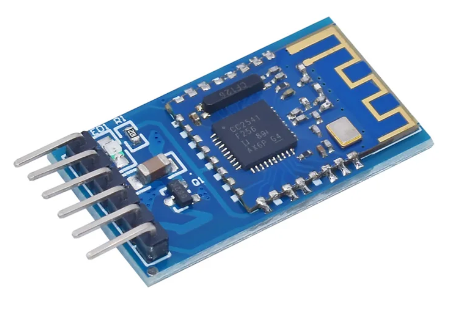

# JDY08_Ring_Buffer
This library is used for interfacing with the JDY08 BLE Module and can estimate the distance based off the RSSI signal

Requirements :
 - Any STM32 MCU
 - JDY08 Bluetooth module (it works with other modules as well)
 - LightBlue mobile app (available on both Android and iOS)

How to estimate the distance based off the RSSI measurement :
First, open the LightBlue app, you should see the module available(under a similar name perhaps) :

